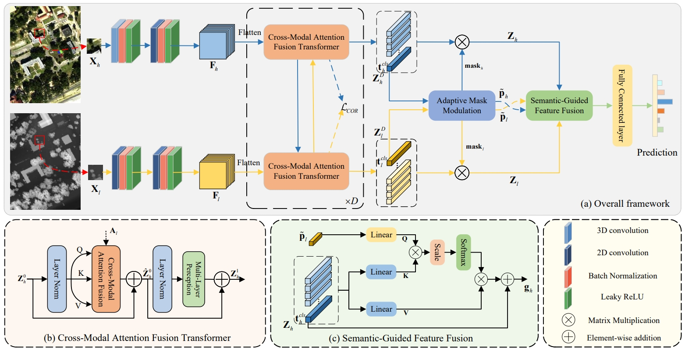

# SPTNet-NTLA

This repository provides the code for the method in our paper '**Multiple Information Collaborative Fusion Network for Joint Classification of Hyperspectral and LiDAR Data**'. (TGRS2024)



**If you have any questions, you can send me an email. My mail address is 22171214790@stu.xidian.edu.cn.**

## Datasets

We conduct experiments on the Houston, MUUFL and Trento datasets. To train and test our model, you should download the required data set and modify the corresponding parameters in *main.py* to meet your needs.

## Requirements

>python 3.7<br>
>torch 1.12.1<br>
>scikit-learn 1.0.2<br>
>numpy<br>
>einops

## Train
By executing the following command, the experimental results can be obtained.
```python
sh run.sh
```
