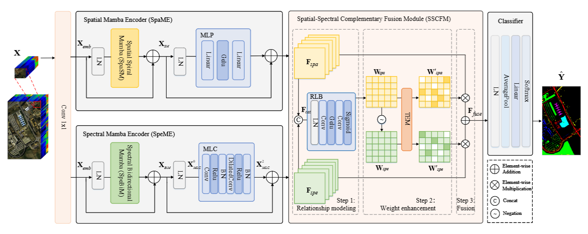

# SpiralMamba

This repository provides the code for the method in our paper '**SpiralMamba: Spatial-Spectral Complementary Mamba with Spatial Spiral Scan for Hyperspectral Image Classification**'. (TGRS2025)



**If you have any questions, you can send me an email. My mail address is yukiyao@stu.xidian.edu.cn.**

## Datasets

We conduct experiments on the Indian Pines, Pavia University, Houston2013 and Houston2018 datasets. To train and test our model, you should download the required data set and modify the corresponding parameters in *main.py* to meet your needs.

## Requirements

>python 3.10<br>
>torch 2.1.1<br>
>torchvision 0.16.1<br>
>mamba-ssm 1.1.2<br>
>causal-conv1d 1.1.1

## Train
By executing the following command, the experimental results can be obtained.
```python
sh run.sh
```
